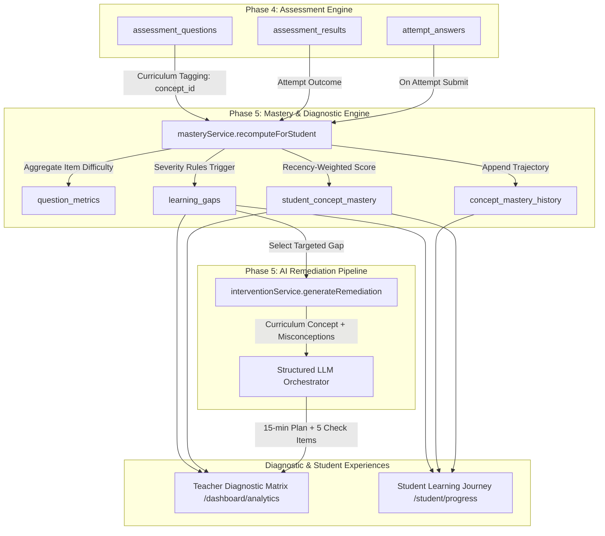
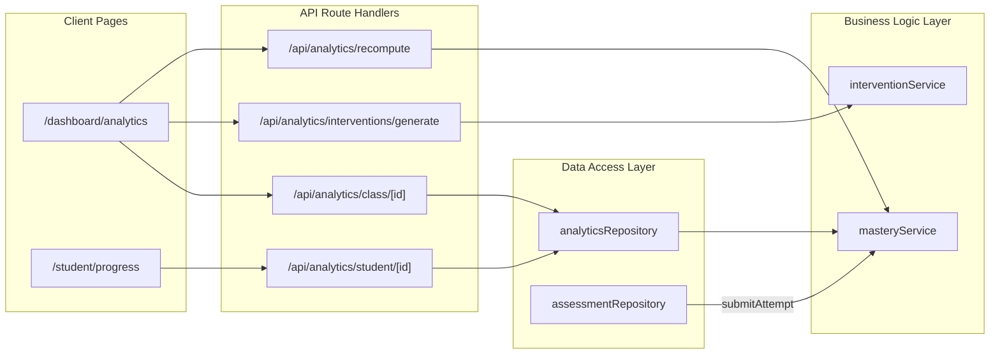

# TeacherSathi — Academic Analytics Architecture

## 1. System Overview & Core Philosophy

The Academic Analytics Subsystem of TeacherSathi translates raw student evaluation data into explainable, curriculum-aligned academic intelligence. Unlike vanity metrics or opaque AI "grades", TeacherSathi treats raw student responses in `attempt_answers` as the immutable, authoritative source of truth, deriving all concept mastery levels, confidence indicators, and learning gap diagnoses through a strictly deterministic, reproducible mathematical pipeline.

---

## 2. Architectural Principles

1. **Deterministic Mastery Derivation**:
   Mastery scores, confidence classifications, and learning gap severities are never generated via LLMs. They are computed using rigorous recency-weighted mathematical formulas ($65\%$ recent attempts, $35\%$ historical attempts).
2. **Authoritative Raw Records**:
   `attempt_answers` and `assessment_results` are immutable historical facts. The analytical tables (`student_concept_mastery`, `concept_mastery_history`, `learning_gaps`, `question_metrics`) are derived read-optimized ledgers that can be entirely recomputed from scratch at any moment.
3. **Curriculum Alignment Guarantee**:
   Analytics map directly to NCERT curriculum hierarchies (`curriculum_grades` $\to$ `curriculum_subjects` $\to$ `curriculum_chapters` $\to$ `curriculum_concepts`). Questions lacking explicit `concept_id` linkage are flagged as `UNMAPPED` and isolated to prevent polluting academic diagnostics.
4. **Student-to-Student Multi-Tenant Isolation**:
   Strict PostgreSQL Row Level Security (RLS) guarantees that students may never view peers' mastery profiles, question attempts, or gap records. Teachers and school admins can only inspect students enrolled in their assigned classes.

---

## 3. Component Architecture

### 3.1 Services
* **`masteryService` (`src/lib/services/mastery.ts`)**:
  * Pure calculation engine executing the 65/35 recency decay formula.
  * Classifies mastery status (`CRITICAL`, `HIGH`, `MODERATE`, `ON_TRACK`).
  * Determines evidence confidence tiers based on attempt counts and temporal spread.
  * Calculates empirical question difficulty based on student cohort error rates.
  * Detects new learning gaps and updates existing gaps upon student reassessments.
* **`interventionService` (`src/lib/services/interventions.ts`)**:
  * Orchestrates targeted AI remedial content for teachers.
  * Formulates structured prompts with concept details, student failure patterns, and grade level.
  * Validates LLM responses against strict pedagogical schemas (`InterventionActivitySchema`).

### 3.2 Repositories
* **`analyticsRepository` (`src/lib/repositories/analytics.ts`)**:
  * `getClassMastery(classId, teacherId)`: Aggregates class cohorts into diagnostic buckets (*Needs Urgent Support*, *Developing*, *Mastery Achieved*), concept matrix, and top struggling concepts.
  * `getStudentMasteryProfile(studentId, requestingUserId, requestingUserRole)`: Retrieves individual concept progress, historical mastery curves, and active learning gaps with security enforcement.
  * `recomputeStudent` & `recomputeClass`: Triggers authoritative recalculation passes.

---

## 4. Pipeline Execution Flows

### 4.1 Real-Time Submission Pipeline
1. Student submits exam via `POST /api/attempts/[id]/submit`.
2. Assessment engine scores answers, applies negative marking, and persists `assessment_results`.
3. Assessment engine immediately invokes `masteryService.recomputeForStudent(studentId, supabase)`.
4. The service fetches all historical `attempt_answers` linked to curriculum concepts, groups by concept, computes updated scores and confidence tiers, appends trajectory points in `concept_mastery_history`, updates `student_concept_mastery`, updates `learning_gaps`, and updates `question_metrics`.

### 4.2 On-Demand Recomputation Pipeline
Teachers can manually trigger class-wide or student-specific recalculation via `POST /api/analytics/recompute` to refresh analytics following batch curriculum re-tagging or legacy data imports.

---

## 5. Performance and Scale Design

* **Composite B-Tree Indexes**:
  * `student_concept_mastery(student_id, concept_id)` for $O(1)$ single-student concept lookups.
  * `concept_mastery_history(student_id, concept_id, calculated_at DESC)` for high-speed chronological trajectory graphing.
  * `learning_gaps(student_id, status)` for rapid filtering of unaddressed learning deficits.
  * `question_metrics(question_id)` for instantaneous empirical difficulty indexing.
* **Separation of History from Snapshot**:
  `student_concept_mastery` maintains only the current state, preventing large join overheads on common dashboard views. Historical snapshots in `concept_mastery_history` are only queried when rendering longitudinal trajectory charts.
