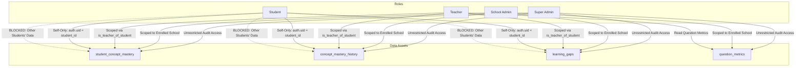

# TeacherSathi — Academic Analytics Security & Data Governance

## 1. Compliance & Legal Framework

Academic analytics and student performance tracking involve sensitive educational data. TeacherSathi is architected to comply with:
* **Digital Personal Data Protection Act (DPDP Act, 2023 - India)**: Mandatory purpose limitation, minimization of child data, and strict access controls.
* **National Educational Technology Forum (NETF) & CBSE Guidelines**: Student privacy in automated assessment systems.

---

## 2. Multi-Tenant Role Isolation Model

Access to analytical profiles, mastery trajectories, and diagnostic gaps is governed by strict role boundaries:

### Access Control Matrix

| Role | Own Mastery Profile | Peer Student Mastery | Class Diagnostic Matrix | AI Remediation Generator | Recompute Analytics |
| :--- | :--- | :--- | :--- | :--- | :--- |
| **Student** | Full Access | **DENIED** (403/Empty) | **DENIED** | **DENIED** | Self-Attempt Trigger Only |
| **Teacher** | N/A | Class Students Only | Assigned Classes Only | Assigned Students/Classes | Assigned Students/Classes |
| **School Admin** | N/A | All Students in School | All Classes in School | School-wide | School-wide |
| **Superadmin** | Full Audit | Full Audit | Full Audit | Full Audit | Global |

---

## 3. Threat Mitigation & Defensive Architecture

### 3.1 Horizontal Privilege Escalation (IDOR)
* **Threat**: A student modifies the API route parameter `/api/analytics/student/[id]` to view or export a classmate's mastery scores or diagnosed learning gaps.
* **Defense**:
  1. The API route verifies `auth.uid()`. If role is `'student'` and `param.id !== session.userId`, it immediately responds with `403 Forbidden`.
  2. The underlying database RLS policy `scm_student_select` validates `auth.uid() = student_id`, guaranteeing zero rows returned even if API route guards were bypassed.

### 3.2 Cross-School Data Leakage
* **Threat**: A teacher from School A requests analytics for a student in School B.
* **Defense**:
  The security-definer function `is_teacher_of_student(p_teacher_id, p_student_id)` validates active class enrollment linkages. If no mutual class membership exists under the teacher's active assignments, access is blocked at the database level.

### 3.3 AI Remediation Prompt Injection
* **Threat**: Malicious student inputs in assessment responses or teacher notes inject adversarial instructions into the AI remediation generator.
* **Defense**:
  `interventionService.generateRemediation` validates all incoming parameters with `GenerateInterventionSchema` (Zod). Concept metadata is loaded authoritatively from the verified `curriculum_concepts` table; student inputs are never interpolated directly into system instructions.

### 3.4 Denial of Service via Bulk Recompute
* **Threat**: An attacker repeatedly triggers `POST /api/analytics/recompute` to cause resource exhaustion in PostgreSQL.
* **Defense**:
  Endpoint requires teacher or admin credentials, is throttled via IP and user rate limits, and scopes recomputations strictly to specific `student_id` or `class_id` targets.
