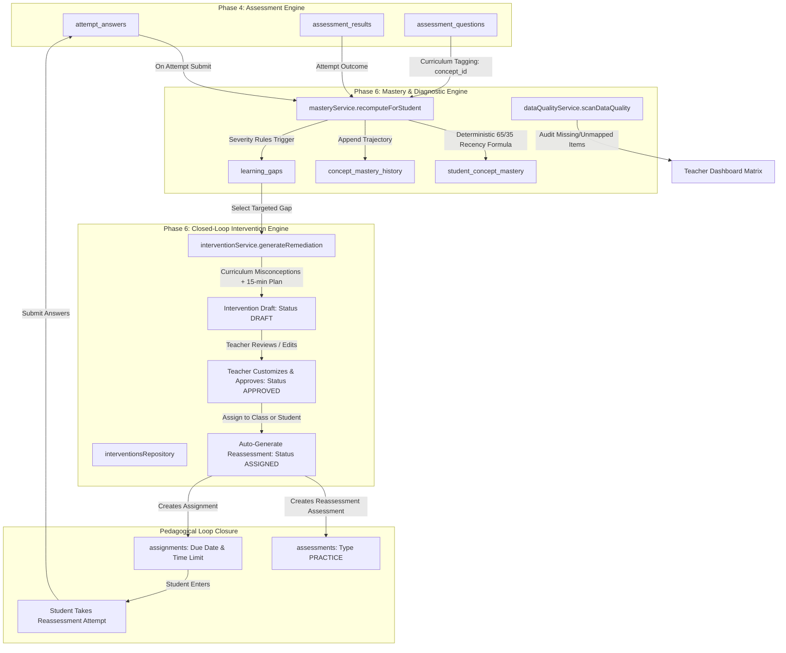

# TeacherSathi — Academic Intelligence Architecture

## 1. System Overview & Core Philosophy

The Academic Intelligence Subsystem of TeacherSathi translates raw student evaluation data into explainable, curriculum-aligned academic intelligence. Unlike opaque AI "grades" or uncalibrated percentage totals, TeacherSathi treats raw student responses in `attempt_answers` as the immutable, authoritative source of truth, deriving all concept mastery levels, confidence indicators, and learning gap diagnoses through a strictly deterministic, reproducible mathematical pipeline.

---

## 2. Architectural Principles

1. **Deterministic Mastery Derivation**:
   Mastery scores, confidence classifications, and learning gap severities are never generated via LLMs. They are computed using rigorous recency-weighted mathematical formulas ($65\%$ recent attempts, $35\%$ historical attempts).
2. **Authoritative Raw Records**:
   `attempt_answers` and `assessment_results` are immutable historical facts. The analytical tables (`student_concept_mastery`, `concept_mastery_history`, `learning_gaps`, `question_metrics`) are derived read-optimized ledgers that can be entirely recomputed from scratch at any moment.
3. **Curriculum Alignment Guarantee**:
   Analytics map directly to NCERT curriculum hierarchies (`curriculum_grades` $\to$ `curriculum_subjects` $\to$ `curriculum_chapters` $\to$ `curriculum_concepts`). Questions lacking explicit `concept_id` linkage are strictly excluded from mastery calculation and flagged in data quality audits to protect academic diagnostic integrity.
4. **Teacher-in-the-Loop AI Safeguard**:
   AI generation creates pedagogical remediation proposals as `DRAFT`. An intervention cannot be assigned to students without explicit teacher review, customization, and approval.
5. **Phase 5 SaaS Entitlement Protection**:
   Class-level diagnostic analytics require the `diagnostic_analytics` entitlement, while automated remediation generation requires the `ai_remediation` entitlement and monthly quota balance.
6. **Multi-Tenant RLS Boundaries**:
   Students can only view their own mastery records and assigned interventions. Teachers can only view mastery and gaps for classes they teach. School admins are restricted to their school. Cross-student, cross-class, and cross-school data leaks are strictly prevented by PostgreSQL Row Level Security and API middleware checks.

---

## 3. Data Flow & Recomputation Pipeline

### 3.1 Synchronous Submission Trigger
Upon student submission of an assessment attempt (`POST /api/attempts/[id]/submit`):
1. `assessmentRepository.submitAttempt` transitions attempt to `SUBMITTED` or `GRADED`.
2. `masteryService.recomputeForStudent(studentId)` is invoked.
3. All finalized attempts for the student are fetched.
4. Evidence is grouped by canonical `concept_id`.
5. For each concept:
   - Recency-weighted mastery score is calculated.
   - Confidence tier is assigned (`LOW`, `MEDIUM`, `HIGH`).
   - Status is categorized (`NOT_STARTED`, `CRITICAL`, `NEEDS_ATTENTION`, `APPROACHING`, `PROFICIENT`, `STRONG`).
   - `student_concept_mastery` is upserted.
   - `concept_mastery_history` appends an audit point.
   - Learning gap detection runs:
     * If mastery $< 60\%$ with $\ge 3$ items: gap created/updated with severity (`CRITICAL`, `HIGH`, `MODERATE`).
     * If $60\% \le \text{mastery} < 75\%$: gap transitions to `IMPROVING`.
     * If $\text{mastery} \ge 75\%$: gap transitions to `RESOLVED` with timestamp.

### 3.2 Idempotency & Replayability
The recomputation pipeline is completely idempotent:
- Invoking `masteryService.recomputeForStudent` multiple times with the same underlying `attempt_answers` yields identical scores and status transitions.
- Shuffling input array order produces the same deterministic result due to internal chronological sorting by `answered_at`.
- Unanswered questions (`is_correct = null`) are cleanly filtered out and never penalize the score.

---

## 4. Integration with Prior Phases

| Phase | Dependency Layer | Integration Point in Phase 6 |
| :--- | :--- | :--- |
| **Phase 1** | Supabase PostgreSQL & Canonical NCERT Curriculum | `curriculum_concepts`, `curriculum_chapters`, RLS policies, multi-tenant profiles. |
| **Phase 2** | Production AI Engine & Structured Schemas | `interventionService` uses schema validation and structured prompts for 15-min lesson plans and 5 practice check questions. |
| **Phase 3** | Classroom Infrastructure & Real-Time Sync | Live classroom presentation can highlight flagged struggling concepts in real-time. |
| **Phase 4** | Production Assessment & Grading | `attempt_answers` and `assessment_questions.question_snapshot` serve as ground-truth evidence; assessment creation powers reassessments. |
| **Phase 5** | SaaS Plans, Entitlements & Quotas | Feature gating protects `diagnostic_analytics` and `ai_remediation` endpoints, decrementing AI quota on generation. |
