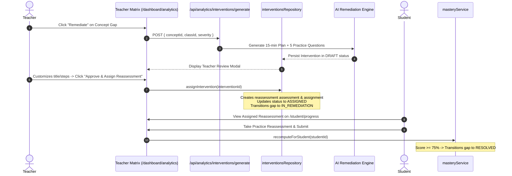

# TeacherSathi — Academic Intervention & Remediation Model

## 1. Pedagogical Intent & Workflow

Generic feedback (such as "Practice more science") fails students and frustrates teachers. TeacherSathi implements a targeted, closed-loop **Intervention Engine**:
1. **Targeted Remediation**: Pinpoints the exact micro-concept where the learning gap occurred.
2. **Misconception-Centric**: Explicitly counters the underlying error model instead of repeating textbook definitions.
3. **15-Minute Micro-Plans**: Structured for realistic classroom or home study windows.
4. **Teacher-in-the-Loop Safeguard**: AI suggestions are persisted strictly in `DRAFT` status and must be reviewed, edited, and approved by a verified educator.
5. **Reassessment Coupling**: Upon teacher assignment, a formal 5-question practice assessment is created and scheduled. Once the student completes the check, mastery is recalculated, and the gap automatically resolves.



---

## 2. Database Schema & Enums

### 2.1 Types & Statuses
```sql
CREATE TYPE intervention_type AS ENUM (
  'REMEDIATION_PLAN',
  'WORKSHEET',
  'PRACTICE_QUIZ',
  'LESSON_PLAN',
  'MIND_MAP'
);

CREATE TYPE intervention_status AS ENUM (
  'DRAFT',
  'APPROVED',
  'ASSIGNED',
  'COMPLETED',
  'ARCHIVED'
);
```

### 2.2 Table Structure (`interventions`)
| Column | Type | Constraints / Description |
| :--- | :--- | :--- |
| `id` | `UUID` | Primary Key, `gen_random_uuid()` |
| `gap_id` | `UUID` | FK to `learning_gaps(id)`, nullable |
| `teacher_id` | `UUID` | FK to `profiles(id)`, NOT NULL |
| `school_id` | `UUID` | FK to `schools(id)`, nullable |
| `concept_id` | `UUID` | FK to `curriculum_concepts(id)`, NOT NULL |
| `chapter_id` | `UUID` | FK to `curriculum_chapters(id)`, nullable |
| `class_id` | `UUID` | FK to `classes(id)`, nullable |
| `student_id` | `UUID` | FK to `profiles(id)`, nullable (null = classwide) |
| `title` | `TEXT` | NOT NULL |
| `type` | `intervention_type` | Default `'REMEDIATION_PLAN'` |
| `resource_id` | `UUID` | FK to `resources(id)`, nullable |
| `content` | `JSONB` | Structured 15-min plan, teacher script, check questions |
| `status` | `intervention_status` | Default `'DRAFT'` |
| `assignment_id` | `UUID` | FK to `assignments(id)`, nullable |
| `reassessment_assessment_id` | `UUID` | FK to `assessments(id)`, nullable |
| `created_at` | `TIMESTAMPTZ` | NOT NULL, `now()` |
| `updated_at` | `TIMESTAMPTZ` | NOT NULL, `now()` |

---

## 3. Intervention Lifecycle States

1. **`DRAFT`**:
   - Initial state when AI generates or teacher drafts an intervention.
   - Visible **only** to the authoring teacher and school administrators.
   - **Never visible to students**.
2. **`APPROVED`**:
   - The teacher has reviewed and confirmed the pedagogical content.
   - Ready to be assigned to an individual student or an entire class cohort.
3. **`ASSIGNED`**:
   - Linked to a created `assignments` record with an explicit due date and time limit.
   - Linked to a created `assessments` record (Type: `PRACTICE`) containing 5 question snapshots.
   - Becomes visible on the student's learning progress dashboard (`/student/progress`).
   - The associated `learning_gaps` record transitions to `IN_REMEDIATION`.
4. **`COMPLETED`**:
   - Marked when all targeted students have submitted their reassessment attempts.
5. **`ARCHIVED`**:
   - Historical record retained for audit trails and longitudinal teacher portfolio reports.

---

## 4. Reassessment Creation Protocol

When `interventionsRepository.assignIntervention(id, teacherId, params)` executes:
1. Validates teacher authorization over the intervention and destination class.
2. Extracts the 5 practice check questions from `intervention.content`.
3. Inserts a new assessment into `assessments`:
   - `type: 'PRACTICE'`
   - `title: 'Reassessment Check: ' + intervention.title`
   - `passing_percentage: 60`
   - `is_published: true`
4. Creates 5 `assessment_questions` with complete `question_snapshot` JSONB objects.
5. Inserts an assignment into `assignments` linked to the class, setting due date.
6. Updates `interventions`:
   - `status = 'ASSIGNED'`
   - `assignment_id = assignment.id`
   - `reassessment_assessment_id = assessment.id`
7. If linked to a `gap_id`, updates `learning_gaps.status = 'IN_REMEDIATION'`.
