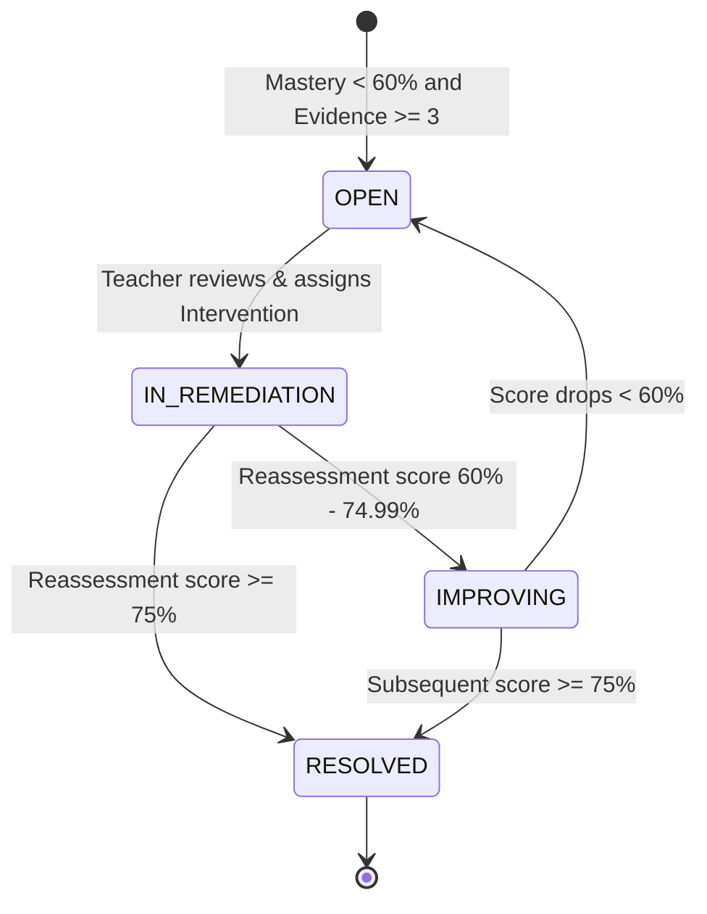

# TeacherSathi — Learning Gap Diagnostic Model

## 1. Concept Gap Detection

A **Learning Gap** is diagnosed when a student demonstrates persistent inability to apply or solve problems related to a specific NCERT curriculum concept. Rather than waiting for high-stakes term exams, TeacherSathi identifies learning gaps incrementally as classroom quizzes, practice tests, and homework assignments are completed.

---

## 2. Severity Classification Matrix

Every diagnosed gap is assigned a severity grade in `learning_gaps.severity`:

| Severity | Mastery Score Range | Minimum Evidence | Pedagogical Meaning & Recommended Action |
| :--- | :--- | :--- | :--- |
| `CRITICAL` | $< 40\%$ | $\ge 3$ items | Severe misconception or total comprehension block. 1-on-1 teacher intervention & visual model required. |
| `HIGH` | $40\% - 59.99\%$ | $\ge 3$ items | Inconsistent application; struggles with problem-solving variations. Needs guided step-by-step practice. |
| `MODERATE` | $60\% - 74.99\%$ | $\ge 3$ items | Partial mastery; approaching proficiency. Micro-worksheet or 5-question check recommended. |
| `ON_TRACK` | $\ge 75\%$ | $\ge 3$ items | No intervention required; student meets NCERT proficiency standard. |

---

## 3. Gap Lifecycle & State Machine

The progression of a learning gap is tracked through `learning_gaps.status`:

1. **`OPEN`**:
   * Automatically spawned or updated by `masteryService.recomputeForStudent` when a student's concept score is $< 60\%$ with $\ge 3$ pieces of evidence.
   * Highlighted on the Teacher Diagnostic Matrix (`/dashboard/analytics`) with an immediate "1-Click AI Remediation" action.
2. **`IN_REMEDIATION`**:
   * Transitions when the teacher reviews the AI-generated remediation plan and clicks **"Approve & Assign Reassessment"**.
   * A targeted 5-question diagnostic reassessment is generated in `assessments` and scheduled in `assignments`.
3. **`IMPROVING`**:
   * The student completes the reassessment or additional practice, and the deterministic recency score climbs into the $60\% - 74.99\%$ interval.
   * Signifies active recovery; student is not fully proficient yet but positive momentum is established.
4. **`RESOLVED`**:
   * The student achieves a mastery score $\ge 75\%$ on the concept.
   * `resolved_at` timestamp is permanently recorded.
   * Badge displayed on Student Progress ledger (`/student/progress`).
5. **`INSUFFICIENT_EVIDENCE`**:
   * Reserved for concepts where student has $< 3$ responses. No intervention gap is prematurely flagged.

---

## 4. Cohort & Class-Level Aggregation

For teachers and school administrators, individual student gaps are aggregated at the classroom level:

$$\text{Class Concept Mastery} = \frac{1}{N_{\text{students}}} \sum_{s=1}^{N_{\text{students}}} Mastery_s(C)$$

$$\text{Struggling Ratio} = \frac{\text{Count}(Mastery_s(C) < 60\%)}{N_{\text{students}}}$$

If $\ge 30\%$ of a class struggles with a concept:
- Flagged on Teacher Dashboard as a **Classwide Conceptual Weakness**.
- Recommends whole-classroom remediation (e.g. 15-minute interactive Smartboard session or classroom activity) rather than isolated individual homework.
