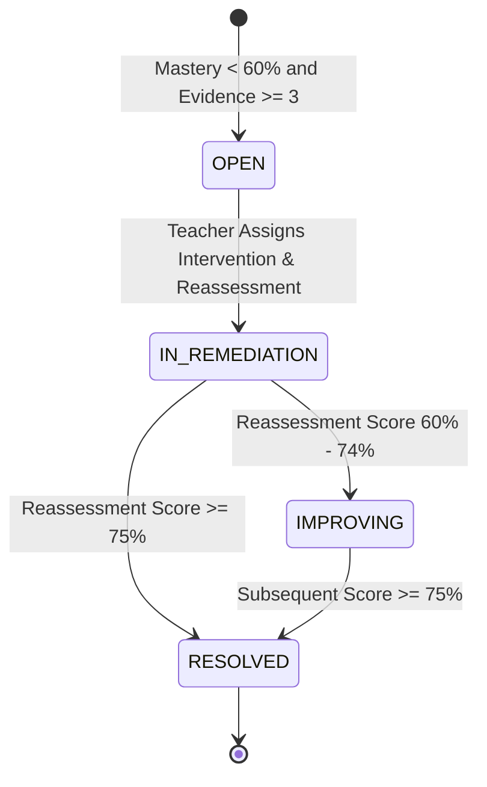

# TeacherSathi — Mastery & Difficulty Calculation Formulas

## 1. Mathematical Mastery Model

Concept mastery in TeacherSathi is modeled as an explainable, time-sensitive, recency-weighted accuracy metric bounded in the interval $[0, 100]$.

### 1.1 The Recency-Weighted Decay Formula
Given a chronological series of student responses to questions tagged with canonical concept $C$:

$$\mathcal{R} = [r_1, r_2, \dots, r_n]$$

where each $r_i \in \{0, 1\}$ (0 for incorrect, 1 for correct, null unanswered items excluded).

#### Base Case ($n \le 2$):
If $n \le 2$, insufficient evidence exists to split historical vs. recent behavior:
$$Mastery(C) = \frac{1}{n} \sum_{i=1}^n r_i \times 100$$
Confidence is set to `LOW`.

#### General Case ($n \ge 3$):
The chronological sequence is partitioned into:
* **Recent Window ($W_R$)**: The latest $k$ items, where $k = \min(5, \lceil n / 2 \rceil)$.
* **Historical Window ($W_H$)**: The remaining items: $[r_1, \dots, r_{n-k}]$.

Recent Accuracy ($A_R$) and Historical Accuracy ($A_H$) are calculated as:
$$A_R = \frac{1}{|W_R|} \sum_{r \in W_R} r \quad\quad A_H = \frac{1}{|W_H|} \sum_{r \in W_H} r$$

The composite mastery score is deterministically computed as:
$$Mastery(C) = \left(0.65 \times A_R + 0.35 \times A_H\right) \times 100$$

---

## 2. Mastery & Gap Status Classification

### 2.1 Concept Mastery Status
| Status | Score Range | Minimum Evidence | Pedagogical Meaning |
| :--- | :--- | :--- | :--- |
| `INSUFFICIENT_EVIDENCE` | N/A | $0$ responses | No evidence recorded for this concept. |
| `CRITICAL` | $< 40\%$ | $\ge 1$ response | Severe misconceptions; immediate intervention required. |
| `NEEDS_ATTENTION` | $40\% - 59.99\%$ | $\ge 1$ response | Inconsistent understanding; needs targeted practice. |
| `APPROACHING` | $60\% - 74.99\%$ | $\ge 1$ response | Developing proficiency; gap is improving. |
| `PROFICIENT` | $75\% - 89.99\%$ | $\ge 1$ response | Solid competence; learning gap resolved. |
| `STRONG` | $\ge 90\%$ | $\ge 1$ response | Deep conceptual mastery and retention. |

### 2.2 Learning Gap Status Transitions

---

## 3. Evidence Confidence Engine

To prevent rash diagnostic actions on thin evidence, each score is accompanied by an Evidence Confidence Level:

| Confidence Level | Evidence Criteria | Usage in Analytics & Remediation |
| :--- | :--- | :--- |
| `INSUFFICIENT_EVIDENCE` | 0 responses | Displayed as unassessed; excluded from class gap cohorts. |
| `LOW` | $1 - 2$ responses | Early indicator; displayed with caution badge. |
| `MEDIUM` | $3 - 5$ responses | Statistically sufficient to trigger automated gap alerts. |
| `HIGH` | $\ge 6$ responses | High confidence; represents sustained longitudinal trend. |

---

## 4. Question-to-Concept Mapping & Unmapped Exclusion Rule

1. **Hierarchy Resolution**:
   - Every question attempted is inspected:
     1. `question_snapshot.concept_id`
     2. `canonical_questions.concept_id`
     3. `assessments.concept_id`
2. **Strict Exclusion**:
   - If no valid `concept_id` can be resolved, the item is **strictly excluded** from concept mastery calculations.
   - It is incremented in `unmappedQuestionsCount` and audited in `dataQualityService.scanDataQuality()`.
   - This ensures curriculum concept mastery is 100% pure and explainable.

---

## 5. Empirical Question Difficulty Calibration

Each question accumulates cohort difficulty metrics from live attempts:
$$\text{Observed Difficulty Rate} = \frac{\text{Incorrect Responses}}{\text{Total Responses}} \times 100$$

| Observed Difficulty | Range | Classification |
| :--- | :--- | :--- |
| `VERY_EASY` | $< 20\%$ error rate | High success rate across cohort. |
| `EASY` | $20\% - 39.99\%$ error rate | Majority answer correctly. |
| `MEDIUM` | $40\% - 64.99\%$ error rate | Good discriminating question. |
| `HARD` | $65\% - 79.99\%$ error rate | Challenging item; tests deeper nuance. |
| `VERY_HARD` | $\ge 80\%$ error rate | Potential distractor or defective question if declared easy. |
