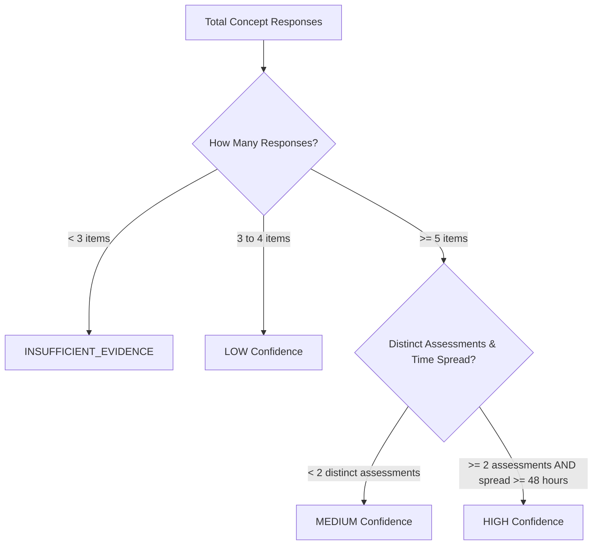

# TeacherSathi — Concept Mastery Model

## 1. Educational Foundations

In conventional learning management systems, student achievement is reported as an aggregate percentage on a test (e.g., "72% on Chapter 4 Test"). This metric fails both teachers and students:
1. It conceals specific micro-concept deficiencies beneath high scores on easier recall questions.
2. It penalizes early mistakes even after a student has genuinely mastered the concept through revision.
3. It conflates question quantity with mastery evidence.

TeacherSathi solves this by decoupling test scores from **Curriculum Concept Mastery**. Assessment items map directly to NCERT atomic concepts (`curriculum_concepts`). Mastery is an evolving, recency-weighted probability of competence on that specific learning standard.

---

## 2. Mastery States & Categorization

Mastery is stored in `student_concept_mastery.mastery_status` as one of four distinct states:

| Status | Mastery Score Range | Minimum Evidence Required | Pedagogical Meaning |
| :--- | :--- | :--- | :--- |
| `NOT_STARTED` | $0\%$ | 0 questions attempted | The student has received no assessment items linked to this concept. |
| `STRUGGLING` | $< 60\%$ | $\ge 2$ questions attempted | The student displays persistent misconceptions requiring diagnostic intervention. |
| `IN_PROGRESS` | $60\% - 79.9\%$ | $\ge 2$ questions attempted | Developing competence; understands basic mechanics but falters under variation or difficulty. |
| `MASTERED` | $\ge 80\%$ | $\ge 3$ questions attempted, Confidence $\ge$ `MEDIUM` | Consistently demonstrates correct understanding across multiple items and time intervals. |

> [!NOTE]
> If a student scores $\ge 80\%$ on an isolated single question, their status remains `IN_PROGRESS` until confidence criteria (`MEDIUM` or `HIGH`) are satisfied. A single correct answer does not constitute proof of mastery.

---

## 3. Evidence Confidence Engine

To prevent misleading recommendations derived from sparse data, every mastery score is paired with an **Evidence Confidence Rating**:

### Confidence Tiers

1. **`INSUFFICIENT_EVIDENCE`**:
   * Total items answered $< 3$.
   * Mastery is provisional; not factored into class-level risk cohorts.
2. **`LOW`**:
   * Total items answered: $3 - 4$.
   * Suggests initial trends, but requires follow-up verification before assigning remedial plans.
3. **`MEDIUM`**:
   * Total items answered $\ge 5$ across at least 1 assessment.
   * Reliable for classroom diagnostic reporting.
4. **`HIGH`**:
   * Total items answered $\ge 6$ across $\ge 2$ distinct assessments with an elapsed time window of at least 48 hours.
   * Confirms durable, longitudinal retention of the concept.

---

## 4. Recency-Weighted Scoring Formula

To reward learning progress and prevent early failure from permanently depressing a student's standing, TeacherSathi employs a **65/35 Recency-Decay Model**:

$$Score_{\text{final}} = (0.65 \times Score_{\text{recent}}) + (0.35 \times Score_{\text{historical}})$$

### Calculation Process:
1. All chronological attempts for a concept are retrieved.
2. Responses are partitioned:
   * **Recent Window ($W_R$)**: The most recent $50\%$ of question attempts (minimum 2 items).
   * **Historical Window ($W_H$)**: The remaining older $50\%$ of question attempts.
3. Calculate accuracy in each window:
   $$Score_{\text{window}} = \frac{\sum \text{Correct Answers in Window}}{\sum \text{Questions in Window}} \times 100$$
4. Blend the scores using the $65/35$ weights.
5. If total items $\le 3$, all items are weighted uniformly as a single window ($Score_{\text{final}} = Score_{\text{all}}$).

---

## 5. Longitudinal Tracking & Immutability

Whenever `recomputeForStudent` executes, a snapshot is appended to `concept_mastery_history`:
* `student_id`: Target student identifier.
* `concept_id`: Evaluated curriculum concept.
* `mastery_score`: Calculated score ($0 - 100$).
* `mastery_status`: Status classification.
* `confidence_level`: Derived confidence tier.
* `calculated_at`: Server timestamp.
* `trigger_attempt_id`: The assessment attempt that triggered this computation pass.

This historical ledger allows students and teachers to inspect learning velocity and trajectory curves over weeks and terms.
