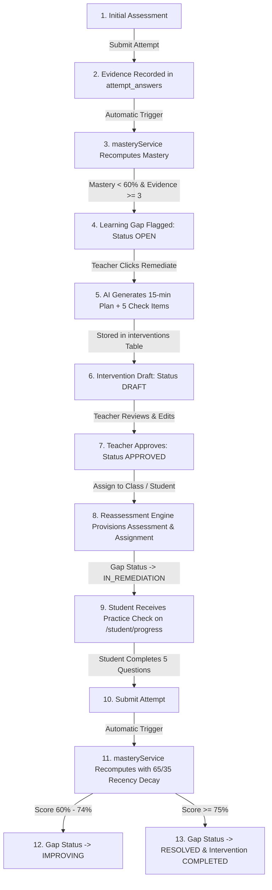

# TeacherSathi — Reassessment Loop & Pedagogical Closure

## 1. Overview

A critical flaw of traditional EdTech systems is the "broken diagnostic loop": systems diagnose weaknesses and produce charts, but never provide a managed mechanism to remediate, retest, and verify that the weakness has actually been resolved.

TeacherSathi closes this loop mathematically, pedagogically, and operationally.

---

## 2. Step-by-Step Architecture of Loop Closure

### Step 1: Initial Evidence Generation
A student takes a quiz, homework, or classroom assessment created in Phase 4. Each question answered is recorded in `attempt_answers` with:
- `is_correct` (`true` / `false`)
- `answered_at` (ISO timestamp)
- Linked `concept_id` (via `assessment_question.question_snapshot`)

### Step 2: Deterministic Mastery Evaluation
Upon attempt submission, `masteryService.recomputeForStudent(studentId)` executes:
- Collects all historical and recent responses for each concept.
- Applies the deterministic 65/35 formula:
  $$Mastery = (0.65 \times A_{\text{recent}} + 0.35 \times A_{\text{historical}}) \times 100$$
- If evidence $\ge 3$ and score $< 60\%$, an entry in `learning_gaps` is upserted with status `OPEN` and severity `CRITICAL` or `HIGH`.

### Step 3: Teacher-in-the-Loop Remediation Generation
On `/dashboard/analytics`, the teacher views the struggling concept and clicks **"Remediate"**:
- `POST /api/analytics/interventions/generate` verifies the teacher's `ai_remediation` entitlement and quota.
- Generates a structured 15-minute pedagogical micro-plan targeting student misconceptions, complete with 5 check questions.
- Saves the plan to `interventions` with status `DRAFT`.
- The teacher reviews the draft in a dedicated modal, can adjust title or pedagogical guidance, and clicks **"Approve & Assign Reassessment"**.

### Step 4: Reassessment Provisioning
The backend method `interventionsRepository.assignIntervention(id, teacherId, params)` executes atomically:
1. Creates a formal assessment record in `assessments`:
   - `type: 'PRACTICE'`
   - `passing_percentage: 60`
   - `duration_minutes: 15`
2. Creates 5 question records in `assessment_questions` with complete `question_snapshot` JSONB objects.
3. Creates an assignment in `assignments` linked to the class and sets due date.
4. Updates `interventions`:
   - `status = 'ASSIGNED'`
   - `assignment_id = assignment.id`
   - `reassessment_assessment_id = assessment.id`
5. Transitions `learning_gaps.status = 'IN_REMEDIATION'`.

### Step 5: Student Reassessment Execution
On `/student/progress`, the student sees:
- **"Assigned Reassessments & Practice Checks"** card.
- Direct CTA: **"Start Practice Check"** linking to `/[locale]/student/assessments/[id]/attempt`.
- The student answers the 5 targeted practice questions and submits.

### Step 6: Loop Closure & Gap Resolution
The submission invokes `masteryService.recomputeForStudent(studentId)`:
- The new reassessment answers enter the student's recent window ($W_R$).
- Due to the $65\%$ recency weighting, correct performance on the reassessment produces a sharp, mathematically justified surge in concept mastery.
- **Outcome A ($60\% \le \text{Score} < 75\%$)**:
  - `learning_gaps.status` transitions to `IMPROVING`.
  - Severity drops to `MODERATE`.
- **Outcome B ($\text{Score} \ge 75\%$)**:
  - `learning_gaps.status` transitions to `RESOLVED`.
  - `resolved_at` is permanently recorded.
  - Mastery status becomes `PROFICIENT` or `STRONG`.
  - The intervention loop is successfully closed.

---

## 3. Mathematical Verification of Closure

Consider a student who struggled with **"Drip Irrigation"**:
- Initial Assessment (5 questions): 1 correct, 4 incorrect ($20\%$ raw accuracy).
  $$W_H = [0, 0], \quad W_R = [0, 0, 1]$$
  $$A_H = 0\%, \quad A_R = 33.33\% \implies \text{Score} = 0.65 \times 33.33 + 0.35 \times 0 = 21.67\%$$
  Status: `CRITICAL`. Learning gap flagged as `OPEN`.

- Remediation Assigned: 15-minute guided review.
- Reassessment Completed (5 questions): 5 correct ($100\%$ accuracy).
  Total 10 responses.
  $$W_R = \text{last } \min(5, \lceil 10/2 \rceil) = \text{last } 5 \text{ responses} = [1, 1, 1, 1, 1] \implies A_R = 100\%$$
  $$W_H = \text{first } 5 \text{ responses} = [0, 0, 0, 0, 1] \implies A_H = 20\%$$
  $$\text{New Mastery Score} = (0.65 \times 1.00 + 0.35 \times 0.20) \times 100 = (0.65 + 0.07) \times 100 = 72.0\%$$
  Status: `APPROACHING`. Gap transitions to `IMPROVING`.

- If the student answers 2 additional practice questions correctly:
  $$W_R = [1, 1, 1, 1, 1] \implies A_R = 100\%$$
  $$W_H = [0, 0, 0, 0, 1, 1, 1] \implies A_H = \frac{3}{7} = 42.86\%$$
  $$\text{Final Mastery Score} = (0.65 \times 1.00 + 0.35 \times 0.4286) \times 100 = 65 + 15.0 = 80.0\%$$
  Status: `PROFICIENT`. Gap transitions to `RESOLVED`.

The student's persistent effort has legitimately overcome past mistakes without erasing their historical record.
