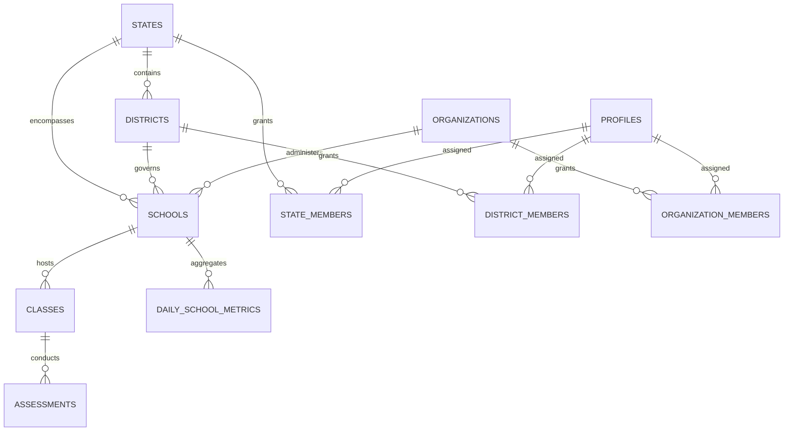

# Phase 8 — Multi-Tenant Data Model & Jurisdictional Hierarchy

## 1. Relational Entity Schema

TeacherSathi's institutional scale model introduces four primary organizational entities, their memberships, and their relations to the existing `schools` table:

---

## 2. Table Definitions

### 2.1 `states`
Represents federal state educational jurisdictions (e.g., Maharashtra, Karnataka, Delhi NCT).
* `id` (UUID, Primary Key)
* `code` (VARCHAR(10), Unique, e.g. `'MH'`, `'KA'`, `'DL'`)
* `name` (VARCHAR(100), e.g. `'Maharashtra'`)
* `region` (VARCHAR(50), default `'NORTH'`)
* `is_active` (BOOLEAN, default `true`)
* `created_at`, `updated_at` (TIMESTAMPTZ)

### 2.2 `districts`
Subordinate educational districts within states (e.g., Pune, Bengaluru Urban).
* `id` (UUID, Primary Key)
* `state_id` (UUID, Foreign Key $\to$ `states(id)` ON DELETE CASCADE)
* `code` (VARCHAR(30), Unique within state)
* `name` (VARCHAR(100))
* `is_active` (BOOLEAN, default `true`)
* `created_at`, `updated_at` (TIMESTAMPTZ)

### 2.3 `organizations`
Multi-school networks, trusts, government societies, or charter chains (e.g., Kendriya Vidyalaya Sangathan, Navodaya Vidyalaya Samiti, DAV Group).
* `id` (UUID, Primary Key)
* `code` (VARCHAR(50), Unique, e.g. `'KVS'`)
* `name` (VARCHAR(255))
* `type` (organization_type: `'GOVERNMENT'`, `'PRIVATE_NETWORK'`, `'TRUST'`, `'CHARTER'`)
* `contact_email` (VARCHAR(255))
* `contact_phone` (VARCHAR(50))
* `website` (VARCHAR(255))
* `is_active` (BOOLEAN, default `true`)
* `created_at`, `updated_at` (TIMESTAMPTZ)

### 2.4 Modifications to `schools`
Extended with nullable foreign keys to support both institutional affiliation and standalone schools:
* `state_id` (UUID, Foreign Key $\to$ `states(id)` ON DELETE SET NULL)
* `district_id` (UUID, Foreign Key $\to$ `districts(id)` ON DELETE SET NULL)
* `organization_id` (UUID, Foreign Key $\to$ `organizations(id)` ON DELETE SET NULL)

> [!NOTE]
> When `state_id`, `district_id`, and `organization_id` are `NULL`, the school operates as an independent standalone school with complete tenant isolation from state, district, and network admins.

---

## 3. Membership & Association Tables

Each jurisdictional tier maintains its own membership table with an active status flag:
1. `state_members` (`state_id`, `profile_id`, `role`, `status`)
2. `district_members` (`district_id`, `profile_id`, `role`, `status`)
3. `organization_members` (`organization_id`, `profile_id`, `role`, `status`)

Unique constraints ensure a user has exactly one active role entry per entity (`(state_id, profile_id)`, `(district_id, profile_id)`, `(organization_id, profile_id)`).
